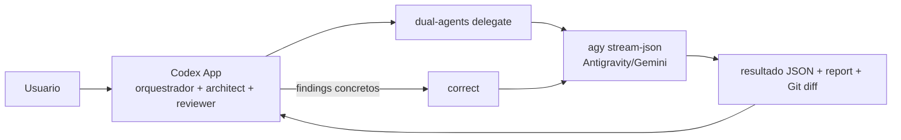

# Dual Agents Orchestrator — Codex Architect + Antigravity/Gemini Executor

Orquestrador local para coordenar o Codex Architect com o unico Executor ativo:
Google Antigravity/Gemini. O Architect interpreta, delega e revisa; o Executor
implementa em modo headless e devolve um relatorio estruturado.

```text
Task → Codex Architect → Antigravity/Gemini Executor → Architect review
                                  ↑                 |
                                  └── correction ───┘
```

Por padrao, o projeto nao faz commit, push, PR ou merge. Uma delegacao pode
autorizar acoes especificas por missao em `authorization.allowed_actions`; os
artefatos ficam em `runs/` e o repositorio pode exigir estado limpo por
configuracao.

## Account profile != Role

Uma conta autenticada e uma coisa; o papel de orquestracao e outra:

```text
Account profile:
executor-account / <codex-home>/executor / sessao autenticada

Role:
executor → executor-account
```

Uma conta pode ter varios roles, e uma conta sem role continua registrada. O
role `reviewer` pode ficar sem atribuicao; nesse caso, a revisao usa a conta de
`architect`. Os roles `architect` e `executor` precisam estar atribuídos para
executar o fluxo.

## Requisitos e instalacao no Windows

- Windows 10 ou 11
- Python 3.11 ou superior
- Git
- Codex CLI instalado e disponivel no PowerShell, inclusive `codex.CMD`

```powershell
py -3.11 -m venv .venv
.\.venv\Scripts\Activate.ps1
python -m pip install -e .
Copy-Item config.example.toml config.toml
notepad config.toml
```

Em `config.toml`, ajuste `repository`, os caminhos `codex_home` e o comando do
Codex. O arquivo local e ignorado pelo Git. Nunca compartilhe `auth.json`.

## Registro de contas

As chaves em `[accounts.<name>]` sao identificadores locais estaveis. `label`
serve somente para exibicao; nao e usado para descobrir ou autenticar uma conta.

```toml
[accounts.primary]
label = "Primary account"
codex_home = "<codex-home>/architect"
model = ""
reasoning_effort = "high"

[accounts.secondary]
label = "Secondary account"
codex_home = "<codex-home>/executor"
model = ""
reasoning_effort = "high"

[roles]
orchestrator = "primary"
architect = "primary"
reviewer = "primary"
executor = "secondary"
```

O sandbox e definido pelo role: `architect`/`reviewer` usam `read-only` e
`executor` usa `workspace-write`. Trocar contas nao troca essas permissoes.

Para adicionar uma terceira conta, sem atribuir role automaticamente:

```powershell
dual-codex account add tertiary --label "Terceira conta"
```

O comando cria um `CODEX_HOME` separado, grava seu `config.toml` sem BOM,
executa o login somente nesse perfil e verifica o status depois. Tambem e
possivel informar `--codex-home`, `--model`, `--reasoning-effort` e repetir
`--role` para uma atribuicao explicita.

Perfis API nao executam login local nem copiam chaves. Registre uma referencia
de ambiente e as capacidades declaradas pelo adapter:

```powershell
dual-codex account add api-openai --backend api `
  --base-url "https://api.example.invalid/v1" `
  --auth-reference "env:DUAL_CODEX_API_KEY" `
  --available-model "model-id"
```

## Comandos CLI

```text
dual-codex account add [name] [--label LABEL] [--codex-home PATH] [--backend BACKEND]
dual-codex account login NAME [--yes]
dual-codex account list
dual-codex account rename OLD-NAME NEW-NAME
dual-codex account label NAME LABEL
dual-codex account enable NAME
dual-codex account disable NAME
dual-codex account remove NAME [--delete-profile] [--confirm-delete]

dual-codex role list
dual-codex role assign ROLE ACCOUNT
dual-codex role unassign ROLE
dual-codex role swap ROLE-A ROLE-B

dual-codex status [--json]
dual-codex dashboard [--port PORT] [--no-open]
dual-codex doctor
dual-codex run task.md
dual-codex delegate --request-file request.json --result-file result.json
```

Exemplos:

```powershell
# Ver todas as atribuicoes sem exibir credenciais
dual-codex status
dual-codex role list

# Mover o trabalho executor para outra conta
dual-codex role assign executor tertiary

# Trocar Architect e Executor
dual-codex role swap architect executor

# Alterar somente o nome amigavel, sem novo login
dual-codex account label tertiary "Conta de testes"
```

`account rename` atualiza as referencias de role sem mover o `CODEX_HOME`.
`account remove` exige que nenhum role use a conta e nao remove o diretorio por
padrao. Para apagar um perfil, use explicitamente `--delete-profile` e confirme
quando solicitado.

## Migracao do formato antigo

O formato antigo com `[architect]` e `[executor]` continua sendo lido para
manter o fluxo funcionando, mas deve ser migrado antes de alterar contas ou
roles. A migracao nao abre login e nao move, le ou regrava `auth.json`.

Primeiro use um dry run:

```powershell
dual-codex migrate-config `
  --architect-name architect-account `
  --executor-name executor-account `
  --architect-label "Conta Architect" `
  --executor-label "Conta Executor" `
  --dry-run
```

Se a pre-visualizacao estiver correta, repita sem `--dry-run`:

```powershell
dual-codex migrate-config --architect-name architect-account --executor-name executor-account `
  --architect-label "Conta Architect" --executor-label "Conta Executor"
```

A migracao cria um backup timestampado de `config.toml`, preserva exatamente os
caminhos existentes, cria:

```text
legacy Architect → orchestrator, architect, reviewer
legacy Executor  → executor
```

Ela aceita TOML com BOM, grava a nova configuracao sem BOM e e segura para
repetir: uma configuracao ja migrada nao e duplicada nem sobrescrita.

Para o layout local ja existente, informe os nomes desejados e mantenha os
diretorios:

```text
<codex-home>/architect
<codex-home>/executor
```

Esses caminhos sao apenas exemplos; nao sao hardcoded no aplicativo e devem ser
substituidos pelos perfis locais de cada maquina.

## Dashboard local de contas

`dual-codex dashboard` inicia o painel Dual Agents em `127.0.0.1` e abre o
navegador; use `--no-open` para apenas imprimir a URL ou `--port` para fixar
uma porta. O painel consulta o App Server por processo/`CODEX_HOME` isolado e
mostra perfis, roles, provider/backend, status do `agy`, modelos, reasoning,
Fast ou outro service tier, rate limits, uso e thread persistente quando
disponíveis.

O campo `model = ""` usa o default do provider selecionado: **Inherit Codex
default** para Codex, **Inherit Antigravity default** para Gemini e **Provider
default** para adapters API. O modelo efetivo só é exibido quando descoberto
pelo catálogo/eventos instalados; nunca é inferido como Sol ou outro valor.
Alterações do painel são validadas e salvas atomicamente para turnos futuros;
a thread persistente atual não é alterada silenciosamente. Métricas ou métodos
não suportados aparecem como `Unknown` ou `Not available`.

Os controles de reasoning e service tier/Fast acompanham imediatamente o
modelo selecionado. Com `model = ""`, o provider controla modelo e esforço; o
dashboard não inventa opções específicas de um modelo desconhecido. Opções
incompatíveis são ajustadas no formulário com aviso, sem alterar a configuração
até `Save`. Cada conta também pode manter vários roles; o editor
por checkboxes aplica o conjunto completo em uma operação atômica e transfere
roles globais para a conta escolhida quando necessário.

A seção **Profiles / Accounts** permite criar, renomear, habilitar/desabilitar e
remover somente o registro de perfis, com validação de `CODEX_HOME` e sem copiar
credenciais. Para Codex, os botões **Authenticate**, **Re-authenticate** e
**Logout** executam apenas o CLI nativo dentro do `CODEX_HOME` selecionado; a
conclusão de navegador, conta ou MFA deve ser feita manualmente pelo usuário.

### Perfis API

Perfis com `backend = "api"` usam o adapter OpenAI-compatible. Configure apenas
`auth_reference = "env:NOME_DA_VARIAVEL"`; a chave nunca é escrita no TOML,
no dashboard ou nos logs. `base_url` aceita HTTPS remoto e HTTP somente para
servidores loopback de teste. `available_models` e
`supported_reasoning_efforts` são a declaração explícita de capacidades; uma
lista de esforços vazia não exibe um controle de reasoning.

O runtime `agy` 1.2.7 não anuncia uma flag de perfil/state-root. Assim, vários
registros Gemini podem coexistir, mas a autenticação Gemini continua
provider-managed e não é declarada como isolada até que o runtime ofereça esse
mecanismo. Codex continua isolado por `CODEX_HOME`.

Remover uma conta remove apenas o registro Dual Agents por padrão. A opção
explícita `--delete-profile` remove somente o diretório local de perfil que o
registro controla e pode remover o `auth.json` mantido naquele `CODEX_HOME`;
isso exige confirmação explícita. A operação não toca keyrings nem credenciais
provider-native fora do diretório controlado.

### Live Executor

O painel tambem possui a visao `EXECUTOR LIVE`, baseada nos eventos reais do
Executor Antigravity/Gemini. Ela le um journal JSONL por conta, role e identidade do
repositorio; nenhum processo Executor falso e criado pelo dashboard. O caminho
do journal e derivado pelo servidor dentro de `runs_dir`, e o navegador nunca
envia um caminho de arquivo.

O historico e limitado pelos valores `live_event_journal_max_records`,
`live_event_journal_max_record_bytes` e `live_event_journal_max_detail_bytes`.
A visao usa o endpoint SSE somente para leitura, retoma por cursor ou
`Last-Event-ID`, mantem uma quantidade limitada de linhas no navegador e envia
heartbeats sem busy loop. `Clear View` remove apenas as linhas renderizadas no
navegador; nao apaga journal nem historico do servidor.

Antes da persistencia, eventos removem ou redigem segredos, caminhos sensiveis,
arquivos de autenticacao e campos de reasoning interno. A interface insere
texto como texto, nao como HTML, e nunca exibe chain-of-thought; reasoning
visivel significa somente o nivel protocolar anunciado. Commands, output,
diffs, files e mensagens aparecem apenas quando ha evidencia do protocolo;
leituras de arquivos nao sao inferidas. O painel continua somente em
`127.0.0.1`, valida Host/Origin, nao oferece shell interativo nem endpoint de
filesystem e operacoes GET/SSE nao alteram configuracao ou journal.

## Status e seguranca

`dual-codex status` mostra contas, labels, caminhos abreviados, login, roles,
repositorio ativo, estado do Git, caminho/versao do Codex e configuracao atual.
Ele nao le `auth.json` para descobrir identidade e nao imprime tokens, conteudo
de autenticacao ou caminhos completos de credenciais.

O `doctor` verifica executavel, perfis, existencia de login, roles necessarios e
repositorio. O login de cada conta usa somente seu proprio `CODEX_HOME`.

## Testes

```powershell
python -m unittest discover -s tests -v
python -m compileall -q src
python -m pip install --no-deps -e .
```

Os testes usam diretorios temporarios e placeholders nao secretos. Nenhum teste
precisa de uma conta Codex real.

## Delegacao visivel pelo Codex App

O fluxo recomendado para uso diario deixa o Codex App como interface visivel:



Conta visivel: `Codex App -> Architect + reviewer`
Executor headless: `agy -> Antigravity/Gemini`

Use a frase natural `Use Dual Agents to implement this task.` no App. O App
inspeciona o repositorio alvo, prepara o pedido JSON, chama o launcher local,
aguarda `DUAL_CODEX_RESULT`, le o resultado, o report, o estado do Git e o
diff, e somente entao apresenta a conclusao. O usuario normalmente nao precisa
abrir o CLI nem criar `task.md`.

O comando principal e:

```powershell
.\scripts\dual-codex.ps1 --config .\config.toml delegate `
  --request-file .\request.json --result-file .\result.json
```

Tambem e possivel usar `--stdin` em vez de `--request-file`. O alvo deve ser
explicito em `repository` no pedido ou por `--repository`; a opcao de linha de
comando tem precedencia. Um repositorio sujo e recusado quando
`require_clean_git = true`; `--allow-dirty` e a excecao explicita.

O App pode consultar o estado sem expor autenticacao:

```powershell
.\scripts\dual-codex.ps1 --config .\config.toml status --json
```

## Transporte Antigravity/Gemini

O backend ativo do Executor e o `agy` instalado localmente. A delegacao usa
`--input-format stream-json --output-format stream-json`, envia um evento NDJSON
por turno e aguarda o evento terminal `result`, preservando `conversation_id` e
diagnosticos stderr. O processo falha fechado em erro, timeout, JSON invalido,
autenticacao indisponivel ou encerramento prematuro; nao ha fallback silencioso
para um Executor Codex.

Configure por conta:

```toml
[orchestrator]
antigravity_command = "C:/Users/USER/AppData/Local/agy/bin/agy.exe"

[accounts.secondary]
backend = "antigravity"
model = "gemini-3.8-flash"
reasoning_effort = "high"
```

O catálogo `agy models` é normalizado no adapter: variantes como
`gemini-3.8-flash-high`, `-medium` e `-low` aparecem como um único modelo com
esforços reais. Modelos fixos como `Claude Sonnet 4.6 (Thinking)` exibem apenas
`Thinking (fixed)`. O mapeamento salvo mantém o slug exato do runtime; uma
variante ausente falha de forma explícita e nunca faz downgrade silencioso.

Os backends Codex existentes permanecem apenas para compatibilidade do Architect
e dos comandos legados. O fluxo `delegate` exige `backend = "antigravity"` no
role `executor` e recusa qualquer substituicao.

## Terminais Windows persistentes

Para visibilidade e fallback TUI, Dual Codex usa ConPTY por meio de um host
Node pequeno (`node-pty`). O Python continua sendo o orquestrador. Cada conta
possui uma sessao independente, `CODEX_HOME`, repositorio, PID e log; o
controle entre Python e o host usa uma named pipe local, sem servidor de rede.
O host desativa a integracao opcional `apps` do CLI para nao depender do MCP
`codex_apps` do Desktop durante uma sessao local.

Instale a dependencia do host uma vez:

```powershell
npm install
```

Abra as duas sessoes visiveis em terminais nativos separados:

```powershell
dual-codex terminal start architect-account --role architect --attach
dual-codex terminal start executor-account --role executor --attach
```

Ao iniciar o `executor` sem `--headless`, Dual Codex abre automaticamente uma
janela de console para `terminal attach --interactive`; esse processo e apenas
um viewer do ConPTY ja gerenciado e nunca inicia outro Codex. Use `--headless`
somente para fluxos que nao exigem uma TUI humana visivel.

Use `dual-codex terminal list`, `send`, `attach` e `terminate` para consultar,
enviar follow-ups, rever a saida e encerrar sessoes. O fluxo `delegate` reutiliza
a sessao persistente do executor para manter o contexto entre mensagens. O
fluxo legado `run` e o fallback para executaveis mockados ainda usam o caminho
one-shot por compatibilidade; o backend persistente nao usa `codex exec`.

No fluxo persistente, o ConPTY e apenas um canal interativo de controle. O corpo
de requests `implement`/`correct` fica em um artefato auditavel em
`runs/executor-task-artifacts`, com SHA-256, e o TUI recebe somente uma mensagem
curta para ler esse arquivo. Isso evita a representacao `[Pasted Content ...]`
do composer para tarefas longas; follow-ups curtos continuam inline e follow-ups
longos usam o mesmo transporte por arquivo. A mensagem de controle e sempre uma
linha; o texto e o Enter (`\r`) sao enviados separadamente.
A entrega tambem aguarda um marcador unico `[DC:...]` aparecer no composer
antes de enviar o Enter; esse acknowledgement tem timeout proprio e nao reenvia
o controle em caso de falha.

A deteccao de atividade tambem e escopada ao processo ConPTY atual: rollouts
historicos e inalterados sao registrados como stale e nao bloqueiam uma nova
readiness, enquanto rollouts criados/atualizados no epoch atual ou associados ao
mesmo `Codex session_id` continuam bloqueando corretamente.

Arquiteturalmente, a implementacao segue o padrao de runtime-process nativo do
Agent Orchestrator (processo por sessao e `node-pty`/ConPTY), o conceito de
Codex como terminal persistente do AWS CLI Agent Orchestrator e o monitoramento
de sessoes/follow-ups demonstrado pelo codex-orchestrator. Esses projetos sao
referencias, nao dependencias nem codigo incorporado.

WSL continua sendo o fallback secundario planejado; o runtime Windows nao usa `danger-full-access`,
`--dangerously-bypass-approvals-and-sandbox`, servidor de rede ou credenciais
compartilhadas.

### Attach interativo e reuse estrito

`dual-codex terminal attach <session-id> --interactive` conecta ao ConPTY
gerenciado, reproduz saida live limitada por cursor/sequence e encaminha teclas
raw para o mesmo processo Codex. `Ctrl-]` faz detach viewer-only e preserva o
ConPTY e o registro; durante uma delegacao o lease de entrada da automacao torna
anexos humanos watch-only. O attach sem `--interactive` continua sendo o
snapshot legado.

O lease humano distingue composicao real, comandos submetidos e configuracao.
Composicao e turnos humanos continuam exclusivos; apos inatividade comprovada o
lease pode expirar e ser readquirido atomicamente. Comandos `/model` e
`/reasoning` liberam o lease quando o prompt ocioso retorna, com TTL curto apenas
como fallback de crash. O snapshot expõe geracao, atividade, expiracao e motivo
sanitizados para diagnostico.

`delegate --reuse-existing` reutiliza somente uma sessao Windows Dual Codex
registrada, viva, pronta e livre do role `executor`, com a mesma conta,
`CODEX_HOME` e identidade do repositorio. Ausencia, stale, busy, PID/epoch
incompativel, viewer ausente ou pipe inalcançavel falham fechado, sem iniciar
outro Codex ou alterar model/reasoning escolhidos manualmente. O registro inclui
host PID, processo Executor, viewer PID, epoch, named pipe e identidades de
conta/repositorio. TUIs abertas arbitrariamente fora do Dual Codex nao podem ser
adotadas.

Consulte [docs/CLI.md](docs/CLI.md), [docs/APP-INTEGRATION.md](docs/APP-INTEGRATION.md)
e [docs/TROUBLESHOOTING.md](docs/TROUBLESHOOTING.md) para os schemas, o fluxo
de correcoes e a recuperacao de falhas.
